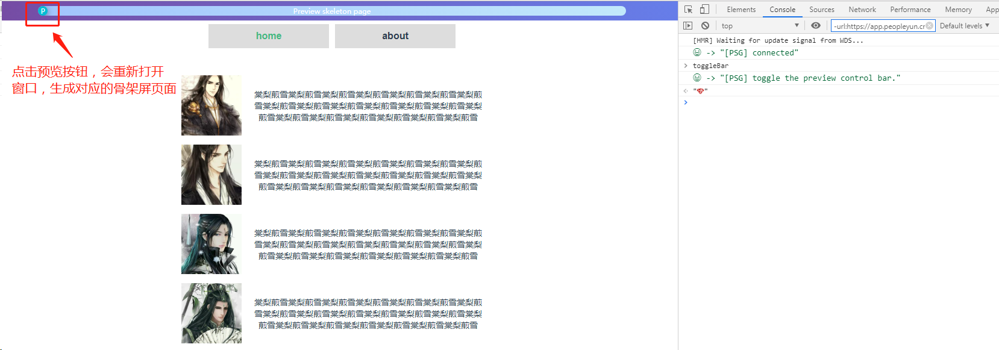
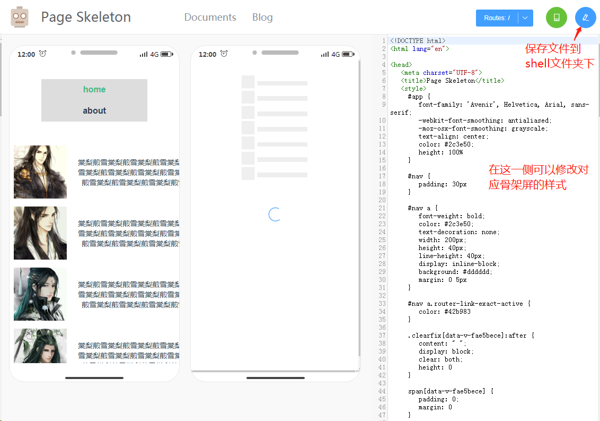

# vuecli3_page_skeleton_usage

## 一、Project setup
```
npm install
```

### Compiles and hot-reloads for development
```
npm run serve
```

### Compiles and minifies for production
```
npm run build
```

## 二、创建骨架屏的步骤

### 1、下载依赖包
```
npm install page-skeleton-webpack-plugin -D
```

### 2、添加vue.config.js文件，引入骨架屏依赖并设置
```
const {SkeletonPlugin} = require('page-skeleton-webpack-plugin');

// configureWebpack配置
configureWebpack: {
  // *************************使用page-skeleton-webpack-plugin骨架屏插件的webpack配置******************************
  plugins: [
    new SkeletonPlugin({
      pathname:path.resolve(__dirname,'./shell'), // 用来存储 shell 文件的地址
      staticDir:path.resolve(__dirname,'./dist'),
      routes:['/','/about'] // 将需要生成骨架屏的路由添加到数组中
    })
  ]
}

// chainWebpack配置
chainWebpack: (config) =>{
  if(process.env.NODE_ENV !== 'development'){
    config.plugin('html').tap(opts => {
      opts[0].minify.removeComments = false // 解决vue-cli3脚手架创建的项目压缩html 干掉<!-- shell -->导致骨架屏不生效
      return opts
    })
  }
}
```

### 3、运行项目并在控制台输入toggleBar命令，生成并修改骨架屏并保存到shell文件夹中




### 4、常见问题
```
// Error: listen EADDRINUSE :::8989

// 修改node_modules/page-skeleton-webpack-plugin/src/skeletonPlugin.js，添加判断
if (!this.server) {
    const server = this.server = new Server(this.options) // eslint-disable-line no-multi-assign
    server.listen().catch(err => server.log.warn(err))
  }
```

```
// 预览骨架屏没有效果

// 需要在项目根目录的public/index.html添加注释
<div id="app"><!-- shell --></div>
```
